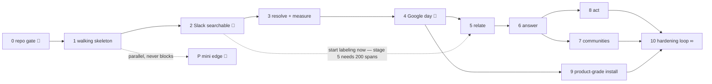

> بِسْمِ ٱللَّٰهِ ٱلرَّحْمَٰنِ ٱلرَّحِيمِ

# The execution plan — eleven stages + one parallel track

Agreed 2026-08-01 ([ADR-0016](../02-decisions/0016-execution-plan.md)). Supersedes the five-phase [`build-order.md`](build-order.md). Visual companion: `renders/kg-execution-plan.html`.

A stage is **done when its exit test is green in CI** — never when a week ends. Sizes are S/M/L, not dates.

## Four sequencing principles

| Principle | What it means here |
|---|---|
| **Deploy the skeleton first, then build inside it** | Compose bundle, `kb deploy`, backups, and the status page go onto the real Hetzner box at stage 1 — *before* features. Every later stage ships continuously into production; backups protect real data from the first week there is any. |
| **Vertical slices, not horizontal layers** | Each stage ends with something usable: search that finds a Slack message, a metric that returns the right number, a cited answer in Slack. Never a layer that only pays off three stages later. |
| **Operator time is the scarcest resource — batch and front-load it** | Vendor-console work is batched into single sittings (all of Google in one stage); the one long-lead human task — labeling 200 spans — starts at stage 2 so it never blocks stage 5. |
| **Observability before the thing it observes** | Status page at stage 1, golden-50 born before answers ship, every connector arrives with its cursor alarm. Nothing runs unwatched, even mid-build. |

## The five gates — every stage, no exceptions

1. **RD agreed** — one page in [`../06-requirements/`](../06-requirements/README.md), written before code, signed off by the operator. **No RD, no branch.**
2. **Built** — on a branch, PR into `main`.
3. **Exit test green in CI** — the RD's exit tests, written as CI assertions *before* the feature.
4. **check-docs green** — docs updated in the same PR; a stale render blocks merge.
5. **Deployed** — `kb deploy` to the real box.

Then **operator sign-off**, recorded in the RD. Skipping a gate is not a shortcut; it's how the predecessor system died.

## The dependency spine

🔑 = needs something only the operator can provide: GitHub auth (stage 0) · labeling start (stage 2) · Google consoles (stage 4) · Full Disk Access + Tailscale on the Mac (track P).

## The stages

### Stage 0 — The repo gate (S · 🔑 blocked on operator)

- **Delivers:** `kb` + `kb-deploy` private on GitHub · CI running unit + real-Postgres tests and check-docs on every PR · branch protection · this docs tree transplants to `kb/docs/` · the Phase-1 code becomes commit #1.
- **Exit test:** a PR with a failing test **cannot merge**; a PR that makes a render stale cannot merge. Code stops living in zip files, permanently.
- **From operator:** 🔑 GitHub auth — a scoped token, or the terminal commands.

### Stage 1 — Walking skeleton, on the real box (M)

- **Delivers:** compose bundle (app · worker · postgres · caddy) · minimal `kb deploy` to the Hetzner box (Tailscale-only; no public port yet) · the **secrets vault + recovery-key ceremony** (needed before the first token arrives next stage) · status page with tri-state checks · pgBackRest → R2 nightly · the restore drill, scripted and run once.
- **Exit test:** destroy the box. `kb restore` onto a fresh one. Status page green, secrets intact. **Install = restore is proven before there's anything to lose.**

### Stage 2 — First real source: Slack, searchable (M)

- **Delivers:** Slack connector (socket mode, per-channel cursors, recorded cassettes) · labels chosen at ingest · FTS over raw · minimal search UI · cursor-stall alarm live.
- **Exit test:** post in Slack → findable within the SLA. Kill the worker mid-backfill, restart: nothing lost, nothing duplicated. Kill it for 15 minutes: the alarm fires.
- **From operator:** Slack app from our manifest (~3 min) · pick channels + labels · 🔑 **start labeling extraction spans now** — a few each week; stage 5 needs 200.

### Stage 3 — Resolve + Measure, deliberately before Google (M)

- **Delivers:** identity engine (deterministic → fuzzy → review queue UI) · metric definitions in git + the runner · numbers from dropped CSVs (filedrop) — metrics exist with zero Google dependency; stage 4 only swaps the transport.
- **Exit test:** "who is X" → one record across Slack handle + email; an ambiguous match returns nothing and queues. `net_sales` for March returns the exact CSV number — twice, identically.

### Stage 4 — Google, in one sitting (M · the operator's one console day)

- **Delivers:** OIDC login (domain allowlist) · Drive + Gmail connectors · registered Sheets → `metric_fact` live · and only now, with real login existing, **the web app goes public on 443**.
- **Exit test:** a teammate logs in with Google and finds a Drive doc in search. The Sheet-fed metric equals the CSV-fed metric to the cent.
- **From operator:** 🔑 the GCP sitting (~15 min, guided): project · APIs · consent screen · OAuth client.

### Stage 5 — Relate: the gateway and the funnel (L · the hard one)

- **Delivers:** model gateway (daily hard-stop, auth-failure detection, cost log) · Haiku triage · Sonnet extraction **behind the eval gate** · claims with mandatory evidence · contradiction + review queues in the UI.
- **Exit test:** gate cleared — precision ≥ .80, recall ≥ .70 on the 200 frozen spans. Re-extraction byte-identical. A claim's evidence link opens the exact source span. Spend halts at the cap — stop first, alert second.
- **From operator:** 🔑 the 200 labeled spans (finished, because labeling started at stage 2) · Anthropic key + cap.

### Stage 6 — Answer (L · the payoff)

- **Delivers:** the three legs (metric.lookup · evidence.search · graph.walk) · composer + citation validator · the **golden-50 harness** · ask in Slack, cited answer back.
- **Exit test:** golden-50 ≥ 90% evidence recall, **100% exact numbers**, every sentence cited or dropped. "Why did sales drop in March?" returns the fact, the hypotheses, and the refusal to overclaim — in Slack, under 10s p95.

### Stage 7 — Communities: global questions (S)

- **Delivers:** nightly Louvain over the claim graph + one Sonnet summary per community, stored as derived docs feeding evidence.search.
- **Exit test:** a "what are our recurring supplier risks?"-class golden question passes with community evidence cited.

### Stage 8 — Act, shadow-first (S)

- **Delivers:** kanban adapter · shadow rows · the flip ritual.
- **Exit test:** one week of shadow rows verified correct → flip → the first real card links the answer that motivated it.

### Track P — The mini edge (M · parallel · optional · never blocks)

- **Delivers:** enroll script · SQLite outbox → `/ingest` · whisper + docling · iMessage + WhatsApp flowing. Starts any time after stage 1.
- **Exit test:** a chat.db message arrives through **the same pipeline** as Slack (the ADR-0009 test) — replay-safe, labeled, searchable.
- **From operator:** 🔑 Full Disk Access on the Mac + Tailscale login — Apple requires the human.

### Stage 9 — Product-grade install (M)

- **Delivers:** the wizard UI (the 16 agreed screens — each connection card already exists from its stage; this assembles them) · the `npx` launcher · automated provisioning · `kb upgrade` with the N−1→N test · nightly real-box install CI.
- **Exit test:** the stranger test — a cold run-through on a fresh account, nothing to nothing-running in ≤ 60 minutes, no help. Install CI green three nights straight.

### Stage 10 — The hardening loop (∞ · a rhythm, not a stage)

Weekly: review queues (identity · contradictions) — 15 minutes. Monthly: the restore drill, on the calendar. Always: **every wrong answer becomes a golden question the same day**; dependency + model-version updates go through the same five gates as everything else.

## The standing harnesses

| Harness | Born in | Catches |
|---|---|---|
| Unit + real-Postgres CI on every PR | stage 0 (exists — 13/13) | logic and store regressions, in minutes |
| check-docs in CI | stage 0 (exists) | doc drift, stale renders, broken links |
| Connector cassettes + nightly live smokes | stage 2, per connector | replay-safety regressions · upstream API drift |
| The eval gate (frozen 200 spans) | stage 5 | a prompt or model change silently degrading extraction |
| Golden-50 (grows forever) | stage 6 | retrieval or numeric regressions — asserted on sets and numbers, never prose |
| Restore drill, monthly | stage 1 | the backup that would not have restored |
| Nightly real-box install CI | stage 9 | install rot — the thing every self-hosted product ships broken |

## Why stage 1 is the plan's strongest opinion

Most plans put deploy, backups, and install polish last — and a system that worked on a laptop meets production for the first time at the end, with everything at stake. Putting the skeleton on the real box first means every stage after it ships to production the day it's done, the restore drill runs monthly against ever-more-real data, and stage 9 is an *assembly* of proven parts instead of a leap.
